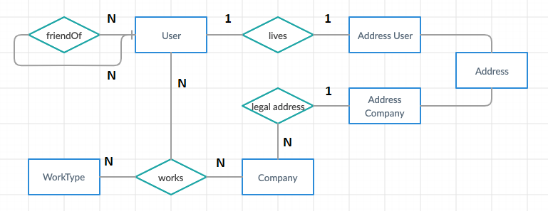

# 2019_assignment3_JobSocialNetwork

## Applicazione  

L'applicazione JobSocialNetwork, scritta in Java, è un nuovo social network 
pensato per il mondo lavorativo, in cui le aziende possono ricercare profili 
interessanti e viceversa.

## Membri  

Il progetto è stato sviluppato da: Beltramelli Fabio (816912) e Finati Davide (817508)

## Repository  

Il codice sorgente è disponibile su gitlab: https://gitlab.com/davidefinati/2019_assignment3_jobsocialnetwork/

## Branches

Sono stati creati e utilizzati i branch master e develop.

## Modello ER
Il modello ER prevede 6 entità e 4 relazioni, tra cui una self (cioè su se stessa) e una
di generalizzazione is-a.

## Modello logico

- User(Id, Name, Surname, Age, ResidentialAddress)  
- FriendsOf(User1, User2, CreationDate)  
- Company(Id, Name, CEO, Description, NumEmployees, FoundationYear, LegalAddress)  
- WorkType(Id, Name, Description, Category)  
- Works(User, Company, WorkType, Salary)  
- Address(Id, Street, Municipality, CivicNumber, CAP, State)  
